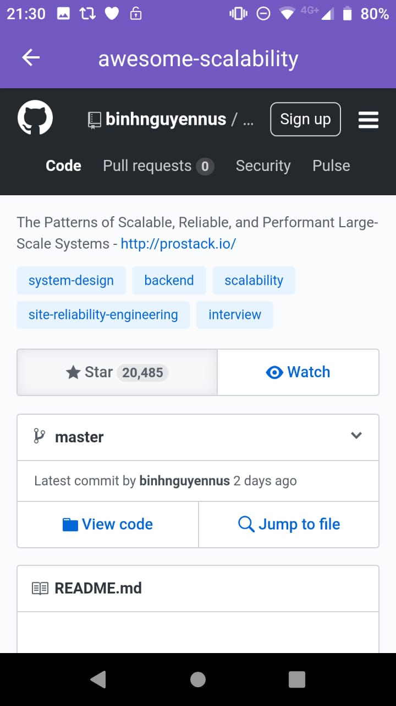
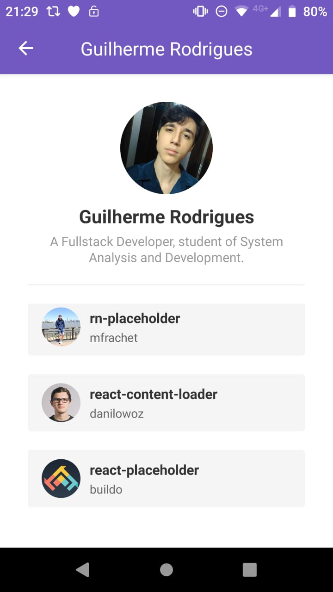

# #06 Bootcamp Challenge

**React Native App** using **Styled Components** and **Axios**.

This App serves as an local database for **storing users** from a list that is **saved on your phone storage** as **cache**.

Using **Axios** for **sending requests to GitHub API**.

## Challenge Result

The API has a limit rate and can be exceeded.
If you get blocked, then our App **will not** run as expected.
